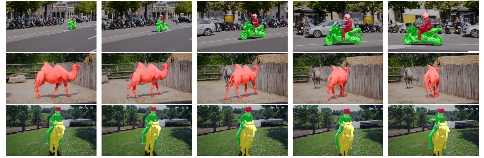

COMatchNet: Co-Attention Matching Network for Video Object Segmentation

The official implementation of COMatchNet.

Our COMatchNet  is a end-to-end trainable model for semi-video object segmentation.

[paper]()

# Framework


# Requirements

> python=3.6
>
> pytorch=1.3.1 and torchvision=0.4.2
>
> opencv=4.4.0 and pillow=8.2.0
>
> tensorboard=2.4.1


# Pretrained Models

[Pretrained models trained on Davis 2017]()

# Segmentation Results

[Davis 2017 segmentation result]()

# Evaluation

To evaluate my model on Davis 2017, run:

```
sudo bash davis_train_eval.sh
```

# Example



**More qualitative results is in [bilibili](https://www.bilibili.com/video/BV1ry4y1M7zs/).**

# Citation

If you find COMatchNet is useful for your research, please consider citing the following paper(accept):

> ```
> @inproceedings{huang2021comatchnet,
>   author = {Lufei Huang, Fengming Sun, and Xia Yuan},
>   title = {COMatchNet: Co-Attention Matching Network for Video Object Segmentation},
>   booktitle = {ACPR},
>   year = {2021}
> }
> ```

