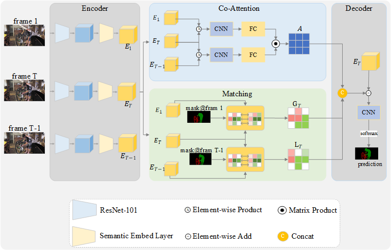

COMatchNet: Co-Attention Matching Network for Video Object Segmentation

The official implementation of COMatchNet.

Our COMatchNet  is a end-to-end trainable model for semi-video object segmentation.

[paper]()

# Framework

# Requirements

> python=3.6
>
> pytorch=1.3.1 and torchvision=0.4.2
>
> opencv=4.4.0 and pillow=8.2.0
>
> tensorboard=2.4.1

# Code

The code is coming soon.

# Example

**More qualitative results is in [bilibili](https://www.bilibili.com/video/BV1ry4y1M7zs/).**

